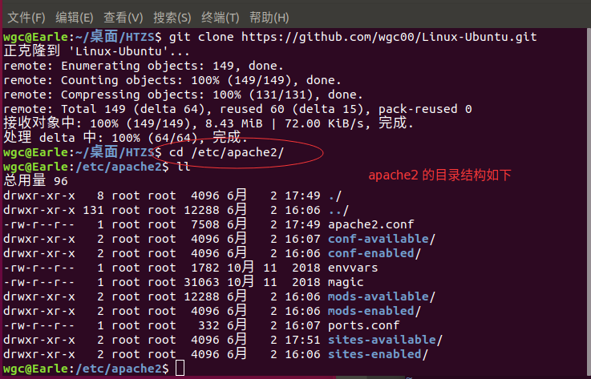
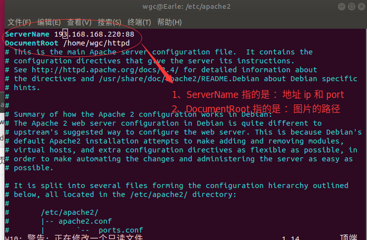
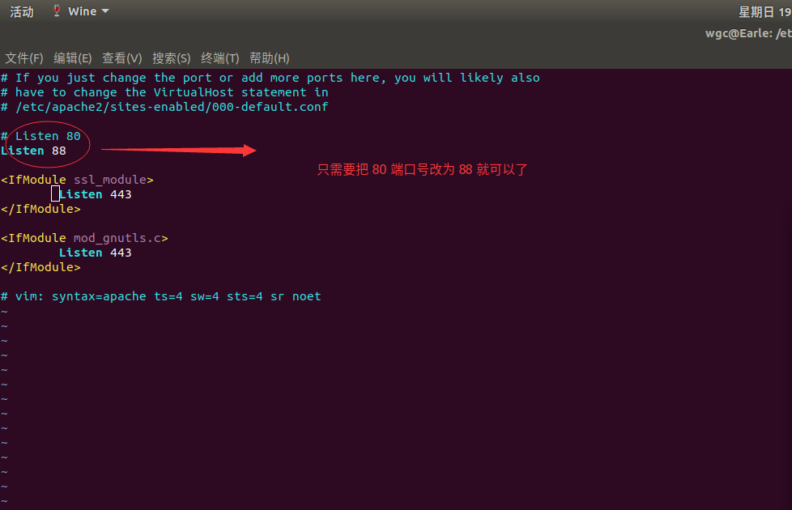
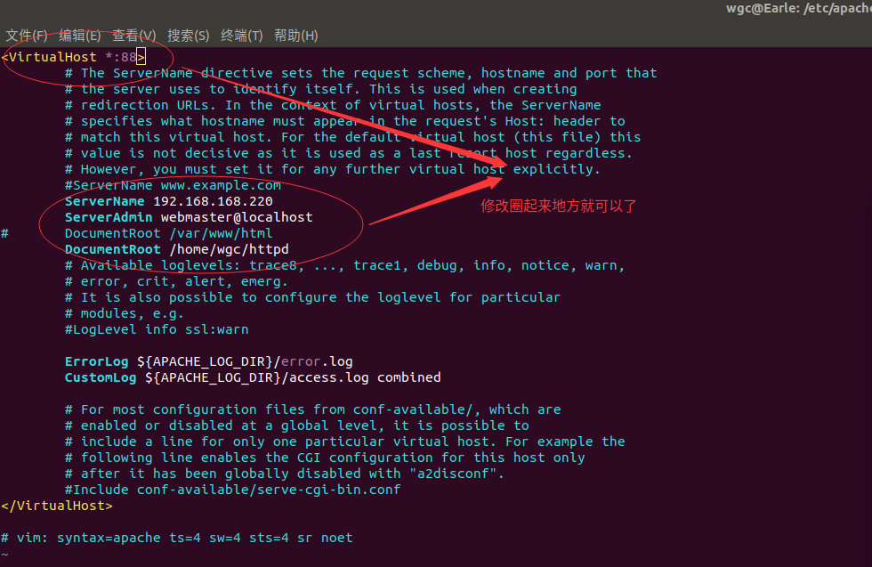
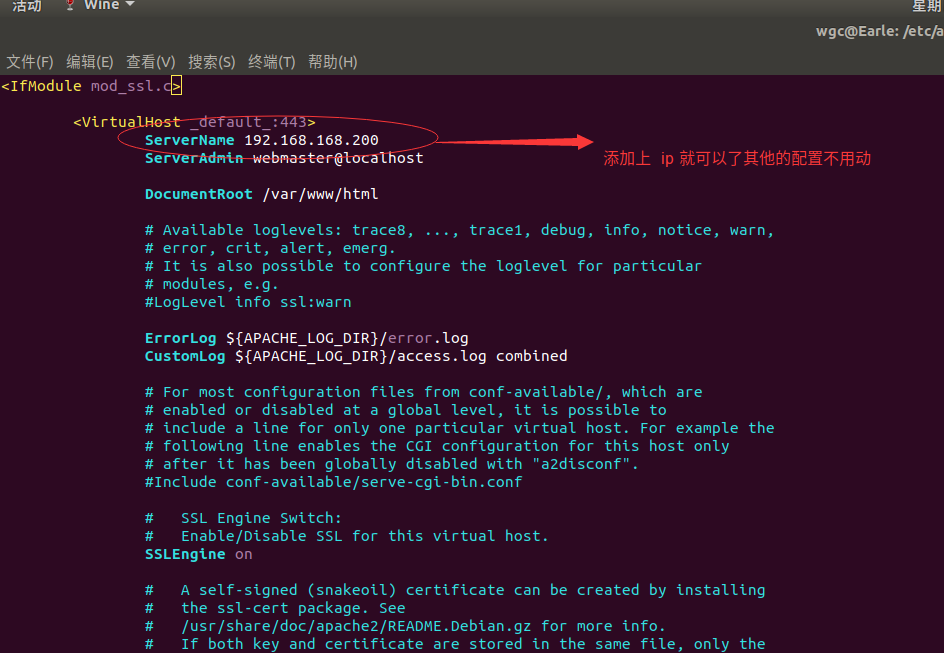
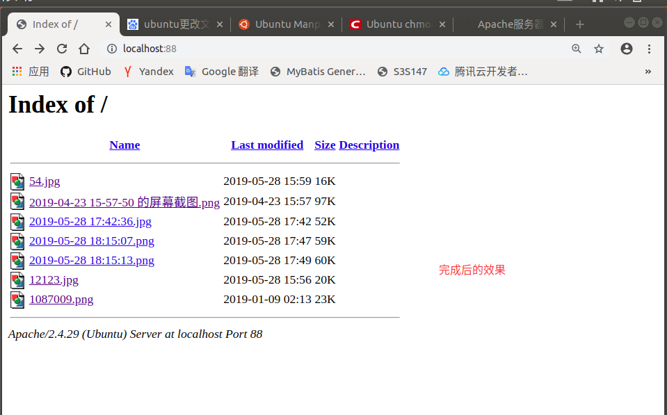

## Apache2 配置文件服务器

### 1、先下载 apache2 
		
		sudo apt-get install apache2

### 2、apache2 默认的端口是 80 和 nginx 有点冲突，所有我们要修改端口号，否则再次启动是会报错，要先**使用 cd 命令 切换到 /etc/apache2/ 目录**	

### 3、要修改的目录如下:
		
		1、apache2.conf
		2、ports.conf
		3、sites-available/000-default.conf
		4、sites-available/default-ssl.conf

### 4、apache2.conf

#### 4.1、修改 apache2.conf 配置的 Direcotry 标签

		<Directory />
        		Options FollowSymLinks
        		AllowOverride None
		#       Require all denied
		</Directory>
	
		<Directory /usr/share>
		        AllowOverride None
		#       Require all granted
		</Directory>
		# /var/www 目录是安装 apapche2 的时候系统默认的目录，我们 /var/www 目录注释掉，在新建一个标签，这个标签表示你具体图片的目录
		# <Directory /var/www>
		#       Options Indexes FollowSymLinks Multiviews
		#       Options Indexes FollowSymLinks Multiviews
		#       AllowOverride None
		#       Order allow, deny
		#       Require all granted
		# </Directory>

		<Directory /home/wgc/httpd>
   		     	Options Indexes FollowSymLinks
        		AllowOverride None	
		        Order allow,deny	# 启用排序
       		        Allow from all 		# 表示所有人都可以访问
	  	</Directory>

### 5、ports.conf 的配置

### 6、000-default.conf 配置

### 7、default.conf 配置

### 8、删除 apache2 

		1、sudo apt autormove apache2
		2、sudo dpke -l | grep apache2 		# 查看还有没有 apache2
		3、sudo su 				# 进入 root 权限
		4、dpkg -l |grep apache2|awk '{print $2}'|xargs dpkg -P   # 执行删除 apache2 的配置信息

### 9、结果

### 10、如果 linux 系统，图片上传时， 是没有其他是没有权限访问的可以使用 java 代码改变权限
	
		 // 修改 自己能读能写，其他人只能读
		 getRuntime().exec("chmod 644 ".concat(file.getPath()));
		 
### 11、如果上传图片还是失败，要直接去修改目录的权限
		
		

