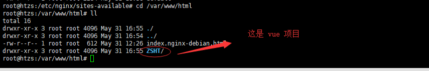

## Nginx 的配置

### 1、 /etc/nginx/sites-available 目录下，配置如下：

		# You should look at the following URL's in order to grasp a solid understanding
		# of Nginx configuration files in order to fully unleash the power of Nginx.
		# http://wiki.nginx.org/Pitfalls
		# http://wiki.nginx.org/QuickStart
		# http://wiki.nginx.org/Configuration

		# Generally, you will want to move this file somewhere, and start with a clean
		# file but keep this around for reference. Or just disable in sites-enabled.
		#
		# Please see /usr/share/doc/nginx-doc/examples/ for more detailed examples.
		##

		# Default server configuration
		#

		# time  earle

		server {
       			listen 80  default_server;
        		listen [::]:80  default_server;

        		# SSL configuration
        		#
        		# listen 443 ssl default_server;
       		 	# listen [::]:443 ssl default_server;
        
        		# Note: You should disable gzip for SSL traffic.
        		# See: https://bugs.debian.org/773332
       
        		# Read up on ssl_ciphers to ensure a secure configuration.
        		# See: https://bugs.debian.org/765782
       
        		# Self signed certs generated by the ssl-cert package
        		# Don't use them in a production server!
        
       		 	# include snippets/snakeoil.conf;
			# vue 项目存放的目录
        		root /var/www/html;

        		# Add index.php to the list if you are using PHP
        		# index index.html index.htm index.nginx-debian.html;
        		
			index index.html index.htm;
        		# 要写 ip 地址 ，如： 192.168.168.2
			server_name localhost;

        		location / {
                		# First attempt to serve request as file, then
                		# as directory, then fall back to displaying a 404.
                		# try_files http://47.112.134.222:8080/ZSHT;
                 		try_files $uri $uri/ =404;
       			}	

		
        		location /api {
	
                		# 后台的 ip 地址
				proxy_pass http://47.112.134.222:8080/api/web/v1/;
        		}
        		# pass the PHP scripts to FastCGI server listening on 127.0.0.1:9000
        
        		#location ~ \.php$ {
        		#       include snippets/fastcgi-php.conf;
        
        		#       # With php7.0-cgi alone:
        		#       fastcgi_pass 127.0.0.1:9000;
        		#       # With php7.0-fpm:
        		#       fastcgi_pass unix:/run/php/php7.0-fpm.sock;
        		#}

        		# deny access to .htaccess files, if Apache's document root
        		# concurs with nginx's one
        		#
        		#location ~ /\.ht {
        		#       deny all;
        		#}

### 2、 /var/www/html	目录

