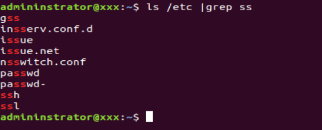
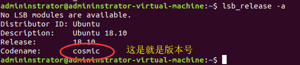
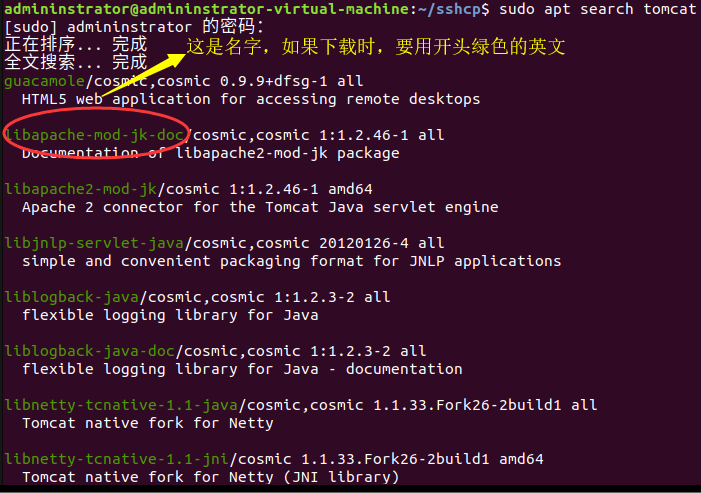

## 目录介绍
		/etc/       	--目录下的文件都是配置文件
		/usr/		--目录下的文件是用户安装的资源文件
		/var/		--目录下的文件是可变的文件，是在执行程序时程序的缓存文件，系统会放在/var/backups/目录下
		/tmp/		--目录：放着一切不重要的文件，随时都有可能要消失的文件
## 常用的查找字符                  
		ls /etc | grep ss（模糊查找） 		  -- | 的意思把前面的输出交给后面的处理
- 
		
		ll					       -- 查看文件的权限管理	 

## 一、Linux 常用的快捷键
		Ctrl + Shift + T				-- 打开终端  
		Ctrl + Shift + C				-- 复制 
		Ctrl + Shift + V				-- 粘贴 
		Ctrl + A					-- 光标移到最前 
		Ctrl + E					-- 光标移到最后 
		Ctrl + P					-- 上移一个句子相等于 ↑键 
		Ctrl + N					-- 下移 相当于 ↓键 
		tab						-- 自动补全 
		Ctrl + R					-- 匹配输入（如果第一次匹配不到，可以在按一次Ctrl + R） 
		history						-- 查看历史，就是以前你输入过的命令 
		Ctrl + C 或 Ctrl + D			       -- 退出 
    
       
		Alt + B						-- 光标往前移动 ←键
		Alt + F						-- 光标往后移动 →键
		Alt + D						-- 删除

## 二、怎么修改国内镜像源     
		sudo 						-- 是超级管理员的意思
- 1、第一步
		lsb_release -a 	 				-- 查看自己系统的版本号Codename：后面是自己的版本号，在修改镜像源时，版本要一样，否则下载其他软件时无法下载。
- 2、第二步	
		sudo gedit /etc/apt/soures.list			-- 打开soures.list文件
		/etc/  						-- 目录下的所有文件都是配置文件可以是 **ls /etc/**命令查看
	
- **阿里的镜像源**
	
		deb http://mirrors.aliyun.com/ubuntu/ cosmic main restricted universe multiverse
		deb http://mirrors.aliyun.com/ubuntu/ cosmic-security main restricted universe multiverse
		deb http://mirrors.aliyun.com/ubuntu/ cosmic-updates main restricted universe multiverse
		deb http://mirrors.aliyun.com/ubuntu/ cosmic-proposed main restricted universe multiverse
		deb http://mirrors.aliyun.com/ubuntu/ cosmic-backports main restricted universe multiverse
		deb-src http://mirrors.aliyun.com/ubuntu/ cosmic main restricted universe multiverse
		deb-src http://mirrors.aliyun.com/ubuntu/ cosmic-security main restricted universe multiverse
		deb-src http://mirrors.aliyun.com/ubuntu/ cosmic-updates main restricted universe multiverse
		deb-src http://mirrors.aliyun.com/ubuntu/ cosmic-proposed main restricted universe multiverse
		deb-src http://mirrors.aliyun.com/ubuntu/ cosmic-backports main restricted universe multiverse

	-- cosmic 是一个版本代号，不同的版本有不同的版本号，**如果系统的版本号与镜像源配置的版本不同，在下载软件时就会报错**
- 
   
- 3、第三步
	sudo apt-get update				   -- 重新刷新，

## 三、怎么创建后缀名java或txt、sql等文件
- gedit 文件名.java 					-- 创建文件
- cat 文件名.java						-- 查看内容
## 四内部的下载软件（在内部不能下载时，就要用到第五步的下载方式），删除
- sudo apt search tomcat				  -- 可以先查看我们要下载tomcat有没有，我们一般下载的是tomcat8
	
- 
	
- sudo apt install tomcat8(下载名)				-- 下载tomcat		
- sudo apt remove -r 软件名				-- 删除某个东西
## 五、怎么下载软件（这里的下载是指一些商标的软件，如idea）
- wget 							  -- 下载的地址（就是url）
- axel -n 32						  -- 多线程下载使用了32个线程下载

## 六、怎么对文件解压和压缩
- 解压文件

		sudo tar zxfv	解压文件的名字.tar.gz				-- 解压
		
		-z:表示先处理压缩文件
		-x:表示解压文件
		-f:表示文件的名字
		-v:表示解压时，显示解压的文件
				
- 压缩文件

		sudo tar czvf 压缩文件的名字.tar.gz				-- 压缩
		
		-c:表示压缩文件
		
		tar zvft 文件名.tar.gz 
		
		-t:表示只看不解压，也不压缩信息
		
		一般使用tar zvft 文件名.tar.gz ，是要查找文件夹中是否有自己想要的文件
			
		tar zvft 文件名.tar.gz | grep 想要的文件名 	 -- 进行了快速查找

## 七、对文件的操作
- ls  -lht						    -- 查看当前文件夹的大小
- du  -sh *						    -- 查看所有文件的大小
- cp 文件名	路径					-- 复制文件
- mv 旧名 新名						 -- 重名
- man(全名：manual)					  -- 是查看帮助文档的意思（如 man apt）
- rm -r 文件名						  -- 删除

## 八、启动服务端的命令

- 启动tomcat8

		sudo systemctl statuc tomcat8	   -- 查看状态
		systemctl start tomcat8		   -- 启动服务
		systemctl restart 服务名		-- 重启服务
		systemctl stop 服务名		-- 停止服务
		systemctl list-unit --type=service	 -- 显示所有已开启的服务
		
