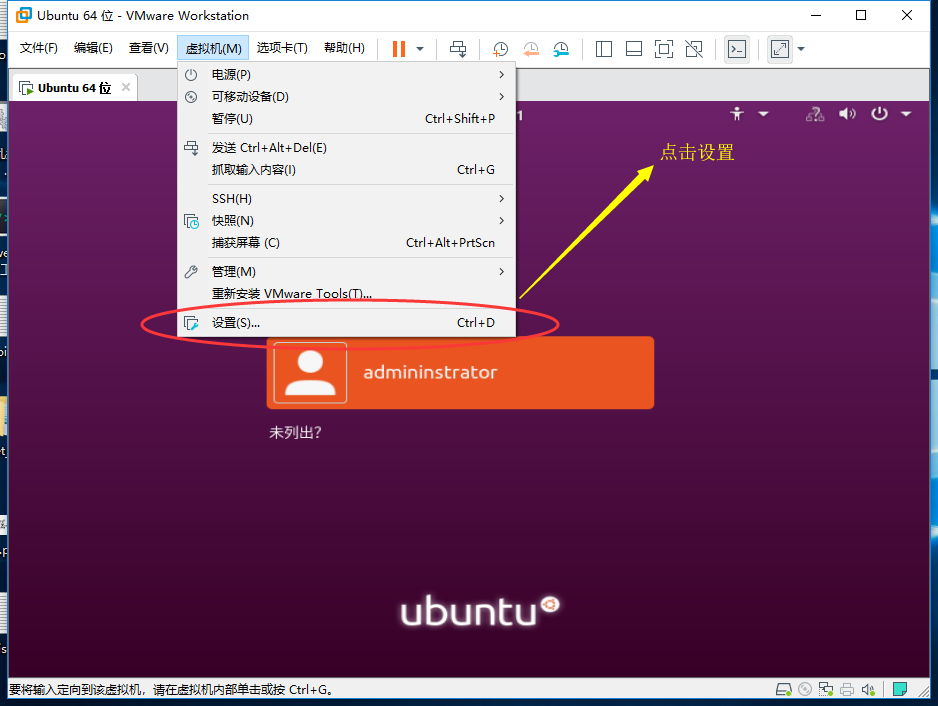
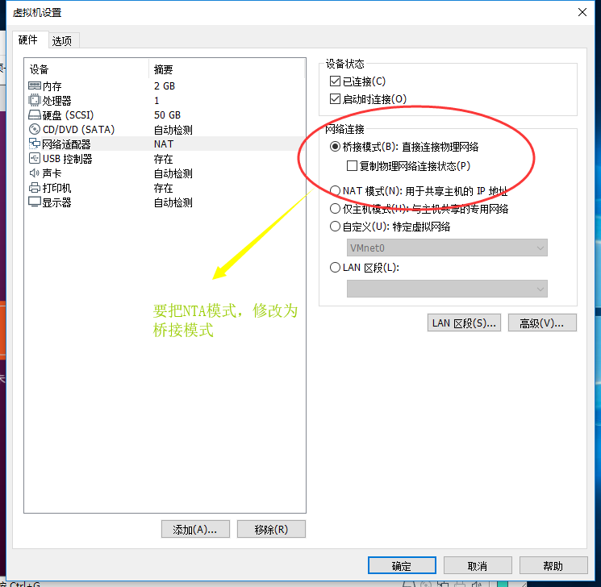
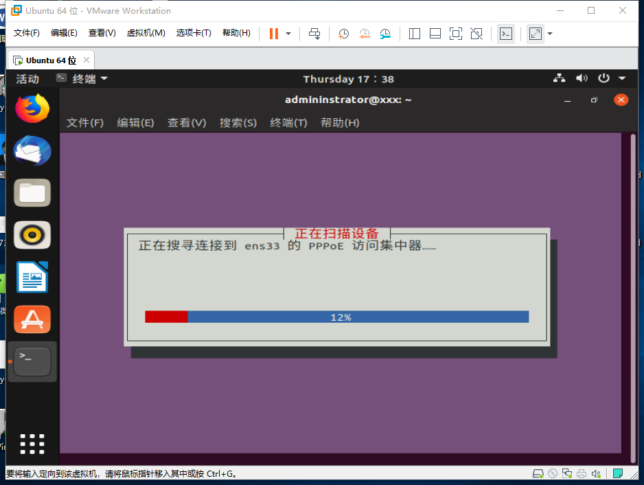
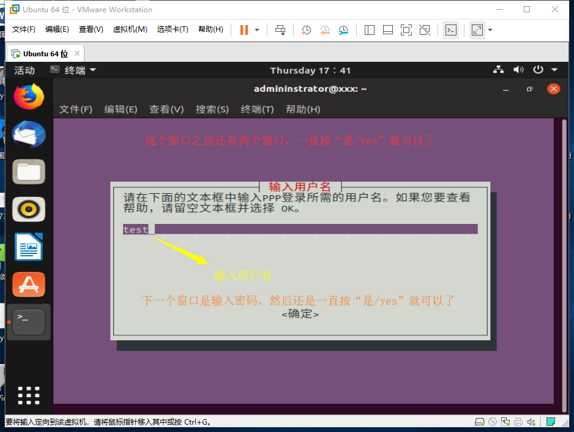
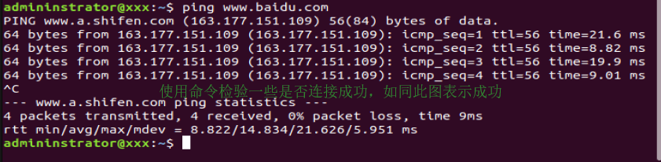
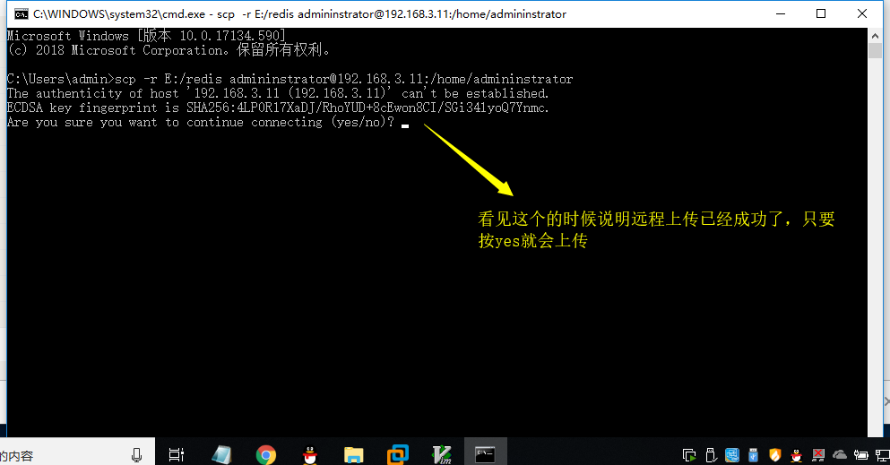
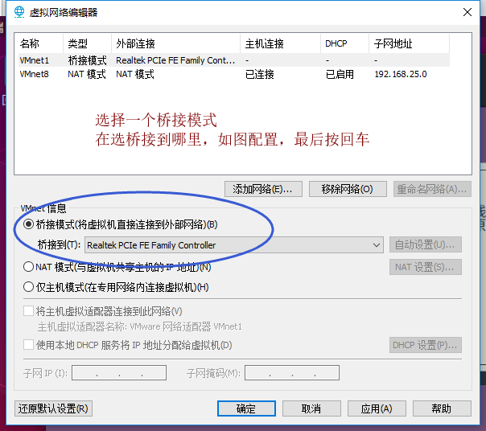
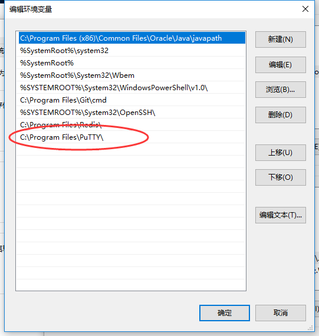

### 一、什么是ftp协议
- ftp是文件传输协议，是TCP/IP协议组中的协议之一，它分成两个部分，一个是ftp服务器，另一个是ftp客户端；主要存储文件的。
- 缺点：ftp协议传输文件，在传输过程中，往往会暴露文件里面的信息内容。
   
### 二、什么是ssh协议
- ssh是一种加密的网络传输协议，可在不安全的网络中为服务提供安全的传输环境。
- ssh通过在网络中简历安全隧道来实现ssh客户端与服务器之间的连接。
### 虚拟机的配置
- 1、

- 2、

- 3、执行网络连接命令 
	
	sudo pppoeconf

- 4、

- 5、

- 6、

- 7、

- **遇到错误，提供一种解决方案**

- 8、

- 9、

- 10、

-  然后在重新执行 3 到 7 步看看

  
### 三、Linux/Ubuntu安装和启动ssh

- 首先要先查看系统是否有ssh:  apt search ssh

- 其次没有就要去下载ssh: sudo apt install openssh-server

- 然后要去修改sshd_config文件

- 

- 最后，在Windows或Linux其他终端执行scp命令就可了

- 
   
### 四、putty-ssh的安装(可执行scp或pscp命令)
- 首先要在本地上下载[putty-ssh](https://www.chiark.greenend.org.uk/~sgtatham/putty/latest.html)软件，然后把putty配置到系统的环境变量中
- 
- 在Windows上打开cmd命令直接执行 scp 或 pscp 如图**scp**
   
### 五、上传本地文件到远程机器指定目录

	 scp /opt/test.tar 用户名@IP地址:/home/用户名

### 六、上传本地目录到远程机器指定目录

	 scp -r /opt/test 用户名@IP地址:/home/用户名

### 七、从远程复制到本地

	 scp 用户名@IP地址:/opt/test/test.tar 本地路径

### 八、从远程复制文件到本地目录

	 scp -r 用户名@IP地址:/opt/test 本地路径
